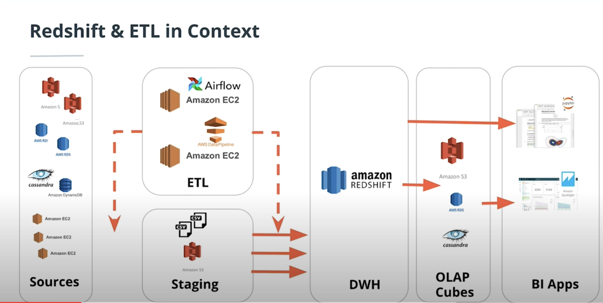
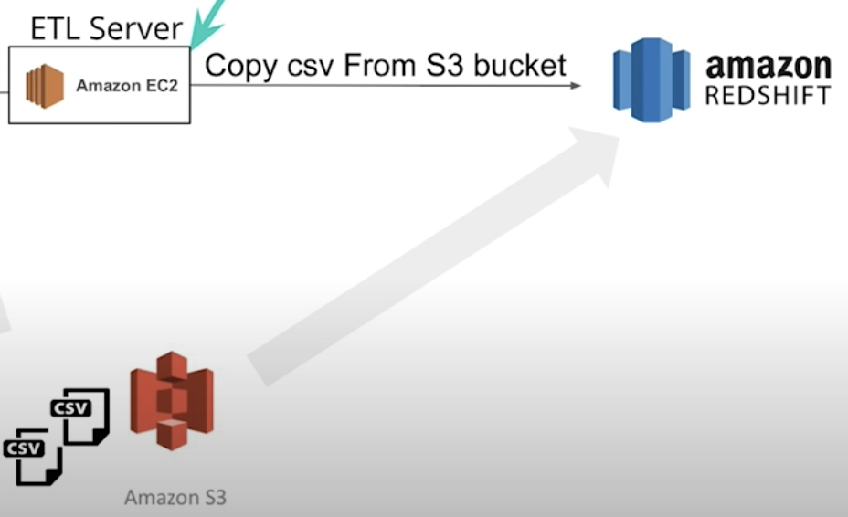

# aws-s3-to-redshift-ETL-pipeline

### Table of Contents

1. [Introduction](#intro)
2. [Project Details](#details)
3. [File Descriptions](#files)
4. [How To Run](#execution)
5. [Data Model](#model)
6. [Licensing, Authors, and Acknowledgements](#licensing)

## Introduction<a name="intro"></a>

This project is part of the Udacity Nanodegree "Data Engineer".
Goal is to apply the learned content about data warehouses and AWS to build an ETL pipeline for a database hosted on Redshift. Part of the project is to load data from S3 to staging tables on Redshift and execute SQL statements that create the analytics tables from these staging tables.

## Project Details<a name="details"></a>

A music streaming startup, Sparkify, has grown their user base and song database and want to move their processes and data onto the cloud. Their data resides in S3, in a directory of JSON logs on user activity on the app, as well as a directory with JSON metadata on the songs in their app.

Goal of this project is to build an ETL pipeline that extracts their data from S3, stages them in Redshift, and transforms data into a set of dimensional tables for their analytics team to continue finding insights in what songs their users are listening to.



## File Descriptions <a name="files"></a>

Here you can see the files of the project with a short description:

```
AWS-S3-TO-REDSHIFT-ETL_PIPELINE/
│
├── README.md
├── requirements.txt
├── dwh.cfg -->config file with all necessary details to run cluster on aws
├── app/ 
    ├── start_cluster.py --> configures IAM role and starts the redshift cluster
    ├── configure_cluster.py --> opens ports on redshift cluster
    ├── create_tables.py --> creates the tables
    ├── run_ETL.py --> stages data from S3 in redshift cluster and inserts data into star schema tables
    ├── delete_cluster.py --> deletes cluster
    ├── create_cluster.py --> contains the datawarehouse class to control the aws instances
    ├── sql_queries.py --> contains all queries
├── prototype/
    ├── dev_notebook.ipynb --> jupyter notebook for developing the code which later was moved to app/
├── images/ 
├── LICENSE


```
## How To Run<a name="execution"></a>

- STEP 1:  AWS secret and access key
  - Create a new IAM user in your AWS account
  - Give it `AdministratorAccess`, From `Attach existing policies directly` Tab
  - Take note of the access key and secret 
  - Change the name of `template_dwh.cfg` to `dwh.cfg` and fill the following fields with your information:
    - `dwh_cluster_identifier` 
    - `dwh_db`
    - `dwh_db_user`
    - `dwh_db_password`
    - `dwh_port`
    - `dwh_iam_role_name`

- Step 2: Create a python3 virtual environment with the dependencies listed on requirements.txt (I used Python 3.8.0). For Mac:
  - `python3 -m venv ./env380`
  - `source env380/bin/activate`
  - `python3 -m pip install -r requirements.txt`

- Step 3: Start up Redshift cluster by running:
  - `python3 start_cluster.py `

- Step 4: Check if cluster is up and in status available by running:
  - `python3 describe_cluster.py`
  - Repeat this step until XXXXx

- Step 5: Open the ports on VPC for incoming and outgoing connections by running:
  - `python3 configure_cluster.py`

- Step 6: Drop old tables if exist and create new tables in redshift cluster by running:
  - `python3 create_tables.py`

- Step 7: Stage the data from the JSON files in the S3 bucket at the redshift cluster and insert data into star schema tables by running:
  - `python3 run_ETL.py`

- Step8: After you are done, you can delete the cluster by running:
  - `python3 delete_cluster.py`


## Data Model<a name="model"></a>

The following tables are created:

- Staging Tables
  - staging_events
  - staging_songs

- Fact Table
  - songplays - records in event data associated with song plays i.e. records with page NextSong - songplay_id, start_time, user_id, level, song_id, artist_id, session_id, location, user_agent

- Dimension Tables
  - users - users in the app - user_id, first_name, last_name, gender, level
  - songs - songs in music database - song_id, title, artist_id, year, duration
  - artists - artists in music database - artist_id, name, location, lattitude, longitude
  - time - timestamps of records in songplays broken down into specific units - start_time, hour, day, week, month, year, weekday

## Results<a name="results"></a>

The result is an ETL pipeline which copies the content of JSON files from an S3 bucket into staging tables on a redshift cluster like depicted in the image below. Inside the redshuft cluster the data is restructured by queries and inserted into fact and dimension tables.



## Licensing, Authors, Acknowledgements<a name="licensing"></a>

I give credit to Udacity for the data.

Feel free to use my code as you please:

Copyright 2021 Leopold Walther

Permission is hereby granted, free of charge, to any person obtaining a copy of this software and associated documentation files (the "Software"), to deal in the Software without restriction, including without limitation the rights to use, copy, modify, merge, publish, distribute, sublicense, and/or sell copies of the Software, and to permit persons to whom the Software is furnished to do so, subject to the following conditions:

The above copyright notice and this permission notice shall be included in all copies or substantial portions of the Software.

THE SOFTWARE IS PROVIDED "AS IS", WITHOUT WARRANTY OF ANY KIND, EXPRESS OR IMPLIED, INCLUDING BUT NOT LIMITED TO THE WARRANTIES OF MERCHANTABILITY, FITNESS FOR A PARTICULAR PURPOSE AND NONINFRINGEMENT. IN NO EVENT SHALL THE AUTHORS OR COPYRIGHT HOLDERS BE LIABLE FOR ANY CLAIM, DAMAGES OR OTHER LIABILITY, WHETHER IN AN ACTION OF CONTRACT, TORT OR OTHERWISE, ARISING FROM, OUT OF OR IN CONNECTION WITH THE SOFTWARE OR THE USE OR OTHER DEALINGS IN THE SOFTWARE.